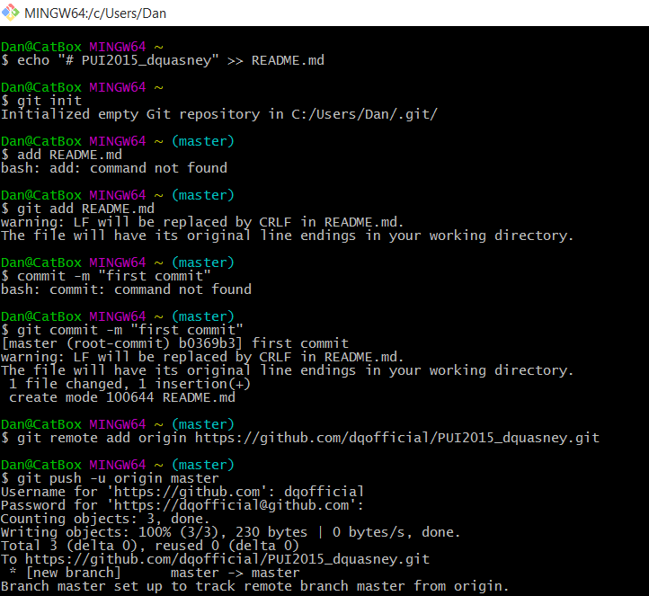
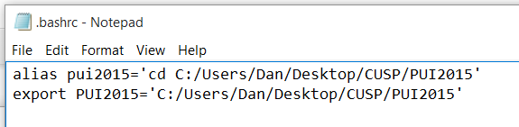
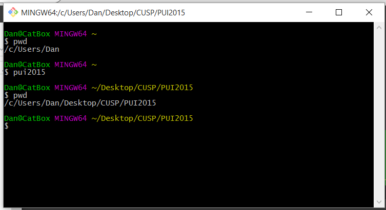

# PUI2015_dquasney

To set up my environment, I first created 'pui2015' as an alias to execute the command
to call my local directory at C:/Users/Dan/Desktop/CUSP/PUI2015. Then, I stored the
filepath to the PUI2015 environment variable.

